# Proyecto academia en proceso
___
### Imagenes de ejemplo del proceso

___

1. home

   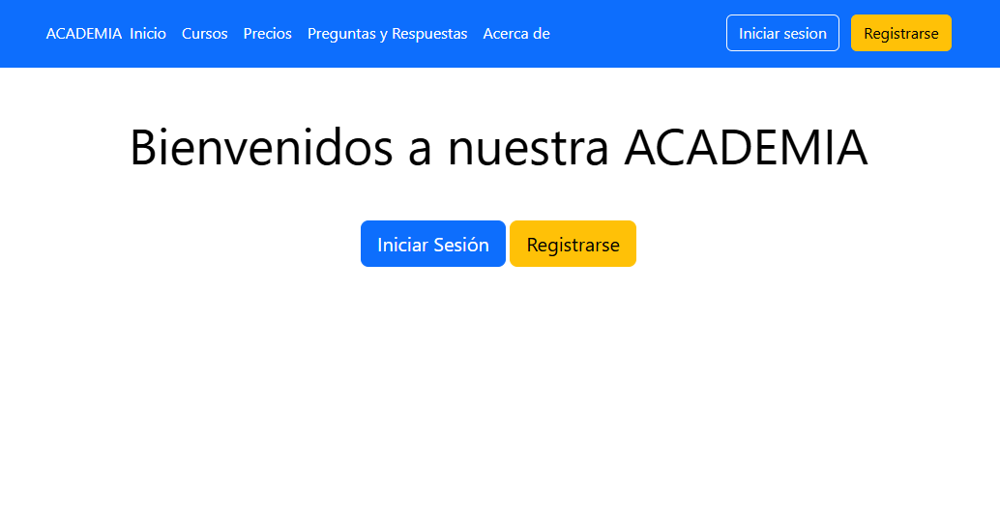

___

2. Pantalla inicio sesión

   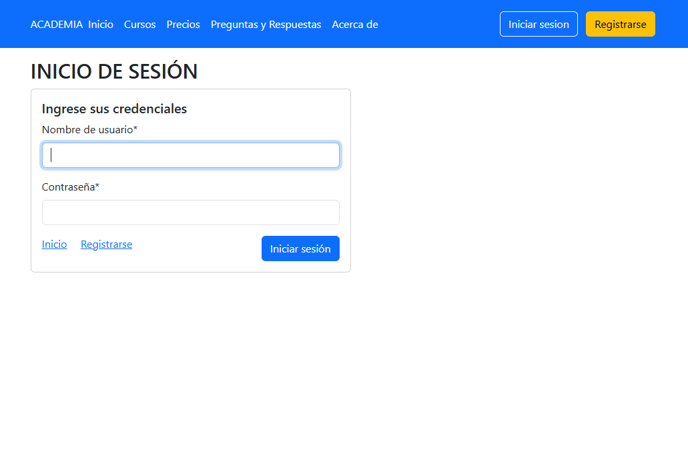

___

3. Pantalla registro

   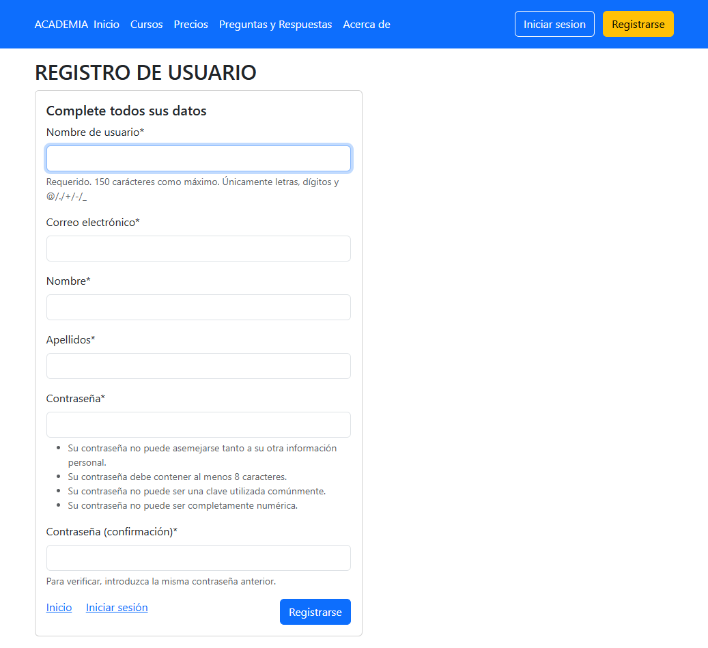

___

4. Login

   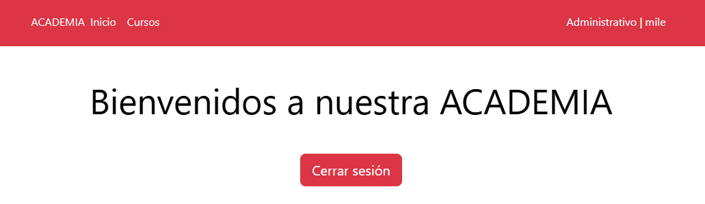

___

5. Perfil

   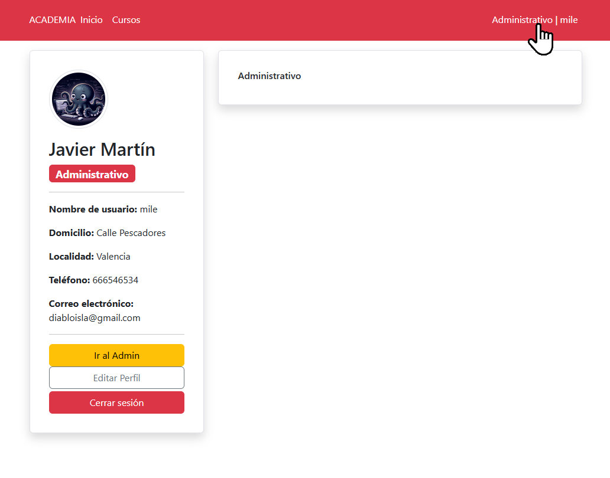

___

6. Permisos y grupos

   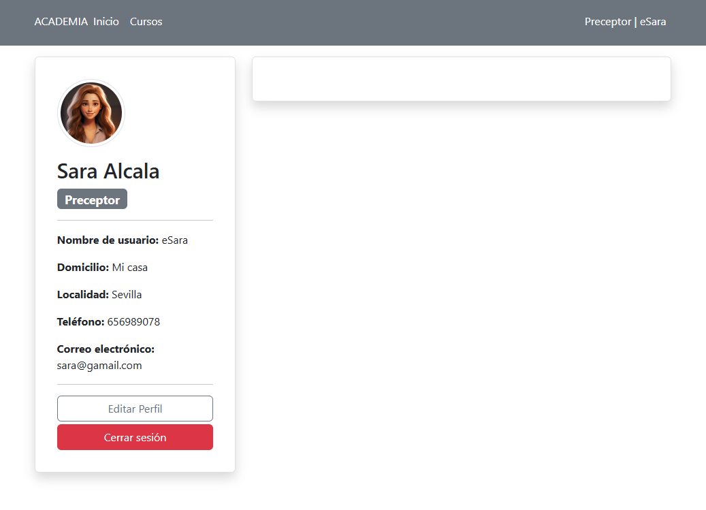

___

7. Editar Perfil

   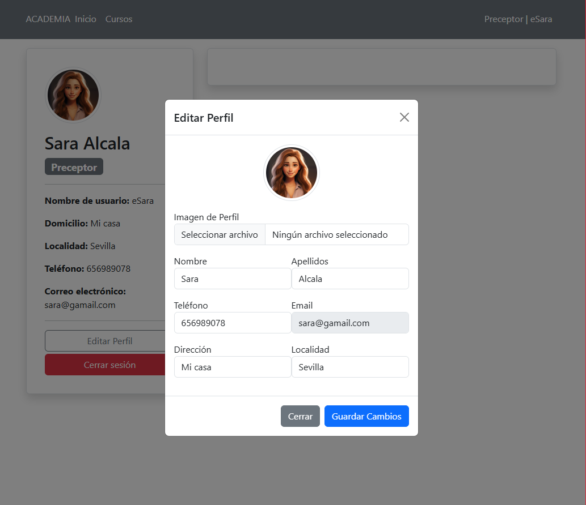

___

8. Pantalla cursos

   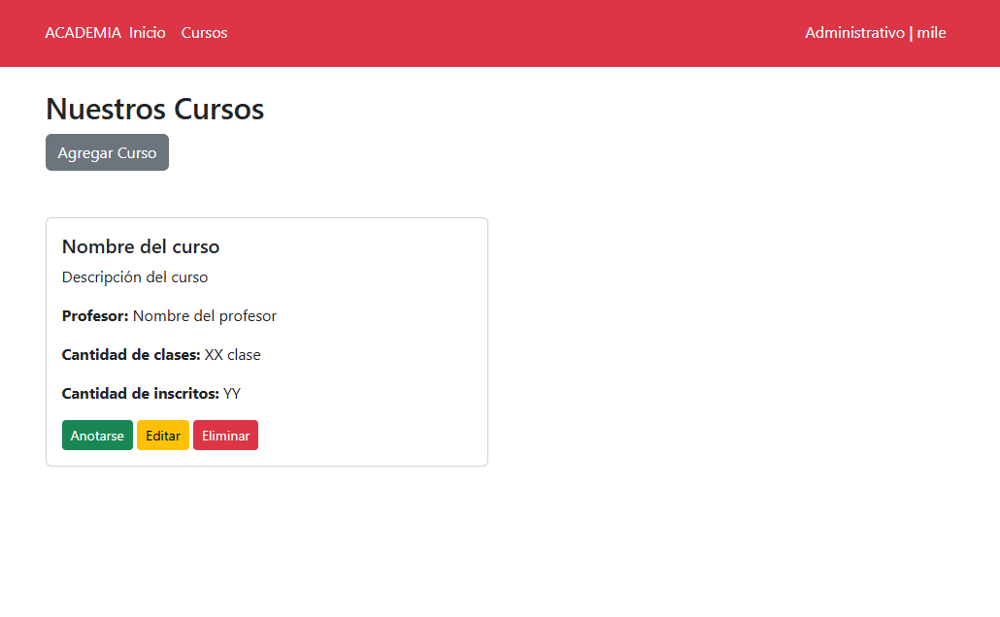

___

9. Ajustes de administración de Django

   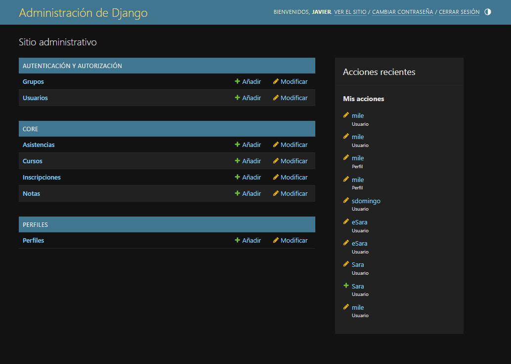

___

10. Opciones distintas por grupos

   - Alumno: Anotarse y Perfil

   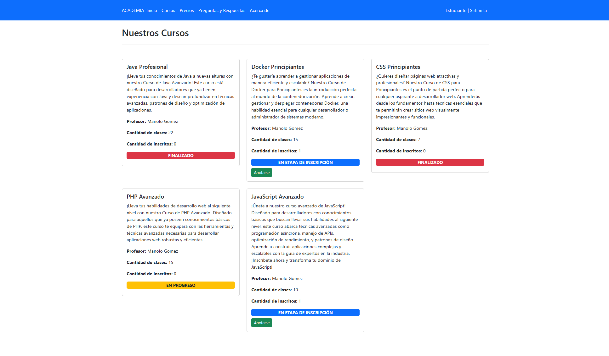

   - Administrativo: Editar y Eliminar

   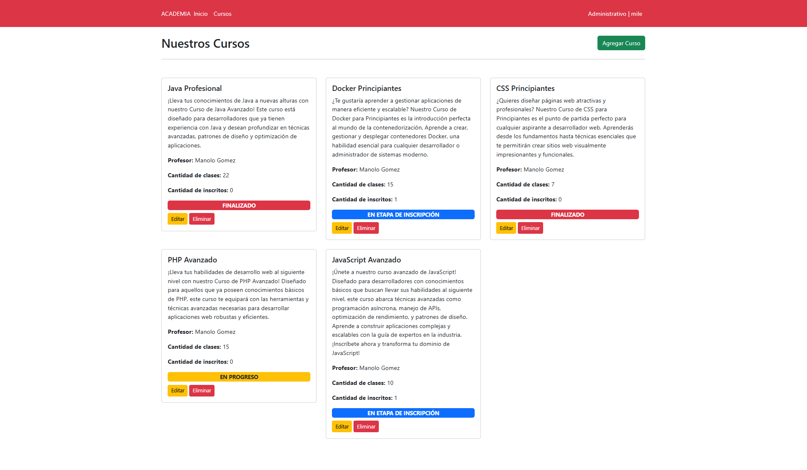

   - Profesor: Nada

   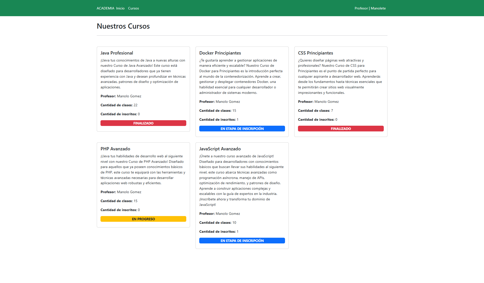

___

11. Botones agregar y Editar Cursos

   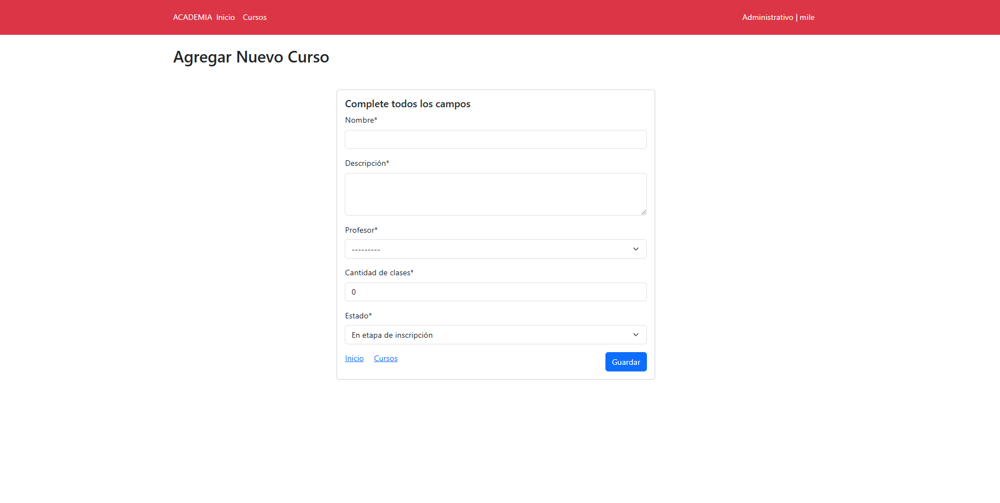

   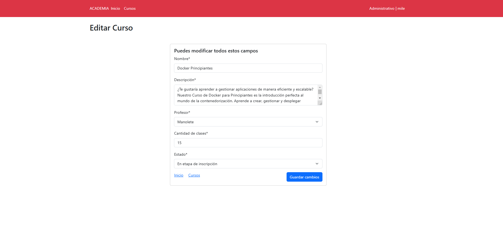

___

12. Registro de cursos en el perfil de profesores

   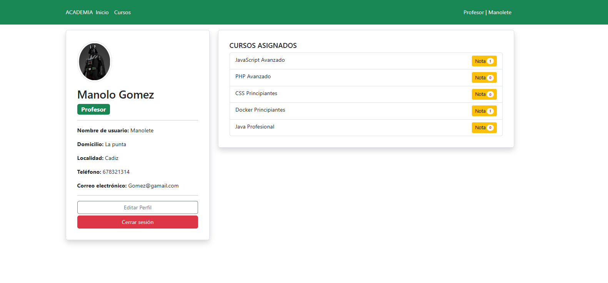

___

13. Modificación de Notas

   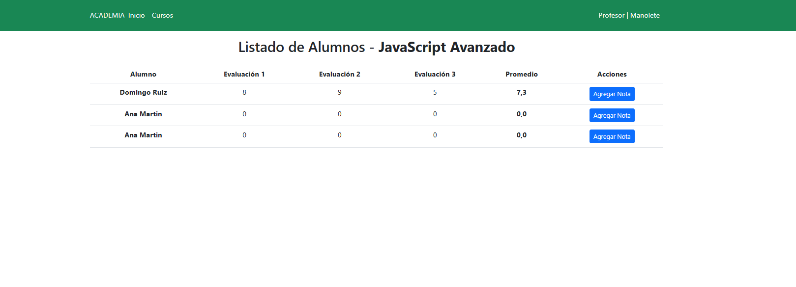

___